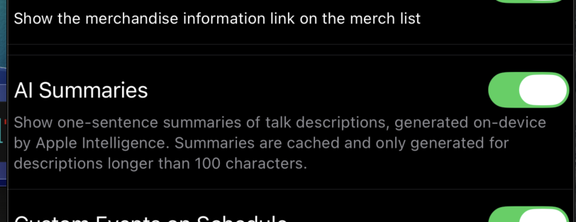

# AI summaries

One-sentence summaries of talk descriptions generated on-device by Apple Intelligence. Optional, gated behind a Settings toggle.

## Requirements

- **iOS 26 or later** (the FoundationModels framework first ships in iOS 26).
- A device that supports **Apple Intelligence** (iPhone 15 Pro / Pro Max, iPhone 16 family, M-series iPad Pro / Air / mini, all later devices).
- The user has Apple Intelligence enabled in iOS Settings → Apple Intelligence & Siri.

On devices that don't meet the requirements, the Settings toggle is hidden entirely.

## Turning it on

**Settings → AI Summaries** → toggle on.



The toggle has a footer explaining the feature:

> Show one-sentence summaries of talk descriptions, generated on-device by Apple Intelligence. Summaries are cached and only generated for descriptions longer than 100 characters.

## What you see

When enabled, each talk row gets a new line below the speaker names:

```
✨  AI-generated one-sentence summary, lineLimit(2).
```

The summary appears in `.foregroundStyle(.secondary)` so it reads as ambient metadata rather than primary content.


## Long-press peek

Sometimes the summary skips a detail you care about. Long-press a row with a visible summary → opens a sheet showing the **original full description** with selectable text. Tap **Done** to dismiss.

The peek sheet only triggers on long-press for rows that have a visible summary. Long-pressing other rows behaves normally (no-op for the navigation tap).

## How it works

Generation is triggered opportunistically when a row materializes in the LazyVStack — i.e., when you scroll close enough that the row is about to be visible.

Each row's generation runs in a background `Task`, deduplicated per row id. The cache is a global `TalkSummaryCache` actor that:

- Stores summaries in `UserDefaults` as JSON, keyed by content id with a SHA256 of the source description.
- Returns cached summaries instantly on subsequent visits.
- Re-generates when the source description's hash changes (the talk got edited server-side).
- Caps at 1,000 entries; evicts oldest first.
- Throttles to 4 concurrent generations to keep battery cost reasonable.

The prompt is biased toward "what will the audience learn" instead of marketing copy, with a cleanup pass that strips prefatory text ("Summary:", surrounding quotes) some model outputs still emit.

## What stays the same

- The original talk description is **never modified** — the summary lives alongside it.
- AI summaries are **never sent to a server** — generation is entirely on-device via Apple's bundled model.
- The 100-character minimum on source descriptions means short blurbs (e.g. "Hands-on workshop") don't waste a model call.

## Disabling

**Settings → AI Summaries** off — rows hide the sparkle line. Cached summaries persist (no point throwing them away) but new ones won't generate.

## See also

- [Privacy and tracking](privacy.md)
- [Schedule view](schedule.md)
