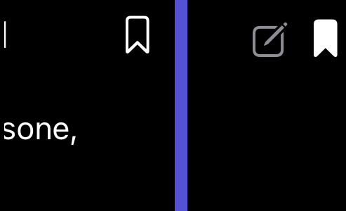
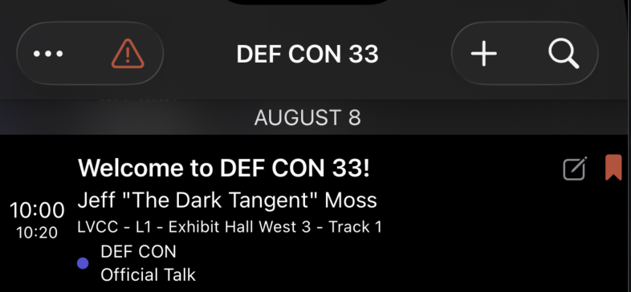
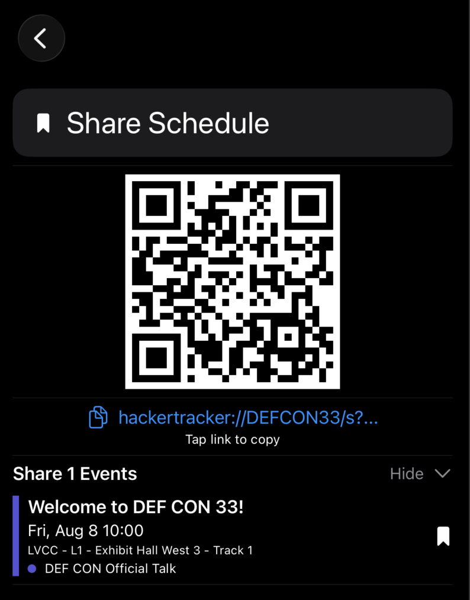

# Bookmarking events

Bookmarks are the simplest way to build your personal agenda.

## How to bookmark

On any list row (Schedule, All Content, Combined Schedule) the **bookmark icon** is on the right side:

- **Outline** — not bookmarked.
- **Filled** — bookmarked.
- **Filled and red** — bookmarked AND in conflict with another bookmarked event.

Tap the icon to toggle. The change persists immediately and syncs to your other devices via iCloud.

You can also **swipe a row left** to toggle the bookmark — useful when scrolling quickly.

## Where bookmarks live

Bookmarks are stored in **Core Data** locally and synced to your Apple ID's **iCloud private database**. We never see them. They survive uninstalls (assuming you sign back into iCloud).

A bookmark is just an event ID; the source event itself comes from Firestore on each app launch.

## Bookmark conflicts

Two events overlap in time → both bookmarks turn **red**. The Schedule toolbar also shows a red warning-triangle icon if you have any active conflicts in the current conference.

Tap the toolbar triangle to see a list of conflicting bookmarks and resolve them.

## Bookmark conflict alert toggle

Tired of seeing red? **Settings → Show Schedule Conflict Alert** off — the red triangle and conflict popup are suppressed. The red bookmark icons themselves stay (they're informational on the row).

## Filtering to bookmarks

Open the filter sheet (bottom-left circle on Schedule or All Content). Tap the **Bookmarks** chip to narrow the list to just your saved events. Combine with other chips using the [Match Any / All toggle](search-and-filter.md).

## Sharing your bookmarked schedule

**Schedule toolbar → menu → Share Schedule** generates a QR code containing all your bookmark IDs. A friend scanning it gets a one-shot view of your selected events without permanently importing anything.

The URL is `hackertracker://CONF_CODE/s?ids=1,2,3,…`.

## Cross-conference bookmarks

If you bookmark events across multiple conferences whose dates overlap, the [Combined Bookmark Schedule](combined-schedule.md) card appears on the home screen.

## See also

- [Combined Bookmark Schedule](combined-schedule.md)
- [Search and filter](search-and-filter.md)
- [Schedule view](schedule.md)
