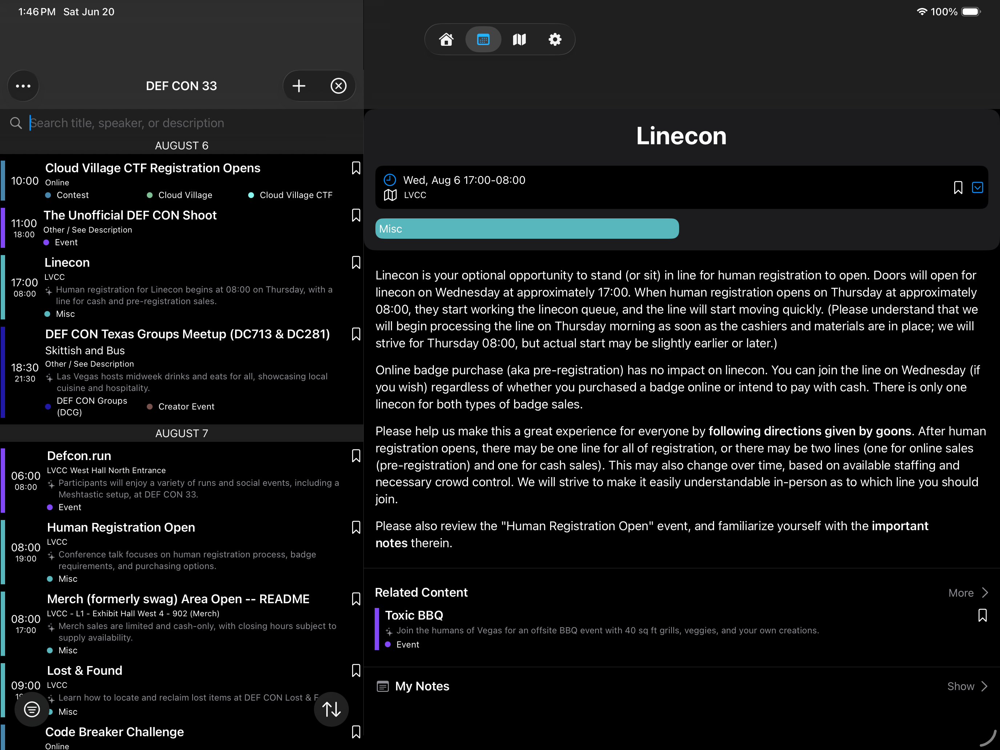
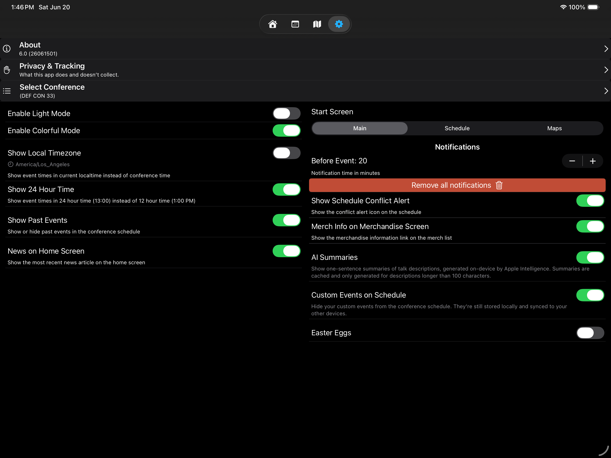

# iPad-specific layout

HackerTracker adapts its layout for iPad. Most screens follow a **two-pane split view** that puts the list on the left and the detail on the right. iPhone uses the same screens stacked vertically with NavigationStack pushes.

## Split view across list screens

The following five screens use the iPad split layout:

- **Schedule** (calendar tab)
- **All Content** (talks list, via Info tab → All Content card)
- **Speakers** (Info tab → Speakers card)
- **Communities / Villages** (Info tab → various organizer cards)
- **Merch** (Info tab → Merch card)

In all five, the **sidebar is 500pt wide** (set in [`IPadAdaptive.sidebarWidth`](../hackertracker/Utils/iPadAdaptive.swift)) and the right pane fills the remainder.

Tap a row in the left list → the right pane updates instantly without pushing onto the navigation stack. Switching to another row replaces the right pane.

This applies to **custom events** too — they route to the right pane just like Firestore events do, not over the sidebar.

## Two-column Settings

Settings on iPad uses an **explicit HStack of two VStack columns** rather than the iPhone's single-column scroll. The conference picker and About card span both columns at the top; the settings rows split below:

**Left column**: Light/Color modes, Show Local Timezone, Show Past Events, News on Home Screen.
**Right column**: Start Screen picker, Notifications, AI Summaries, Custom Events on Schedule, Easter Eggs.

This is automatic — there's no manual layout selection.

## Maps on iPad

The current build uses a **single-page paged layout** on iPad regardless of orientation. An earlier 6.0 beta experimented with a two-up landscape mode; that's been removed in favor of consistent one-map-at-a-time UX.

The floating zoom pill sits in the bottom-left of the map area and is bumped up to clear the page indicator dots.

## Toolbar consistency

iPad detail panes fill **edge-to-edge** in the right column. There's no inner readable-width cap — the column itself is already at a comfortable reading width given the 500pt sidebar.

iPhone detail screens render full-width as expected (no split layout possible at iPhone widths).

## Why 500pt?

A 500pt sidebar lands at roughly **42% of an 11" iPad's landscape width**, matching the visual balance of the Communities tile grid. Earlier 6.0 betas used 380-420pt sidebars which left detail panes feeling sparse.

This value is the single source of truth — `IPadAdaptive.sidebarWidth`. If you ever want a wider or narrower sidebar, it's a one-line edit.

## Custom events in the split

Tap a custom event row in the iPad Schedule sidebar → the right pane shows the custom event detail (title card, time, location, tags including the "Custom Event" chip, description, notes block, conference badges, notifications status, and the edit/share/delete actions).

## Source

Most of the iPad logic lives in:

- [`hackertracker/Utils/iPadAdaptive.swift`](../hackertracker/Utils/iPadAdaptive.swift) — width constant, environment keys for split selections
- [`hackertracker/Views/EventsView.swift`](../hackertracker/Views/EventsView.swift) — the Schedule split implementation; mirror pattern in the other four list screens

## See also

- [Quick Start](quickstart.md)
- [Tabs and navigation](navigation.md)
