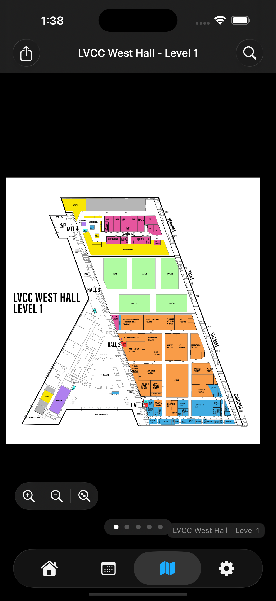
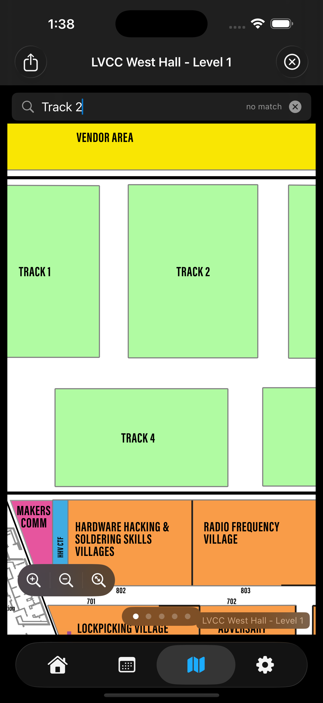
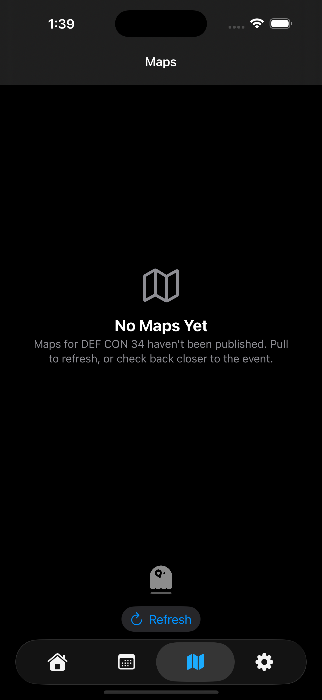

# Maps

Conference venue floor plans. Available from the map icon in the tab bar.

## Layout

A horizontally-swipeable stack of maps. Page indicator dots at the bottom show your position. The title bar shows the current map's name.

## Controls

**Floating zoom pill** — bottom-left of the map area. Three icons stacked horizontally:

| Icon | Action |
|---|---|
| **+ magnifier** | Zoom in 25% |
| **− magnifier** | Zoom out 25% |
| **↔ magnifier** | Reset to fit-to-page |

Pinch gestures work too. Double-tap to zoom in / out at a specific point.

**Toolbar buttons**

- **Leading (top-left)** — **Share** the active map as a PDF via the system share sheet. AirDrop, Save to Files, Copy, etc.
- **Trailing (top-right)** — **Search** (only visible when the current map has SVG support — see below).

## SVG search

When the conference publishes a **searchable SVG version** of a map alongside the PDF, the app prefers the SVG. You'll see a magnifying-glass icon in the trailing toolbar.

Tap it to open a search field at the top of the map. Type to find text on the floor plan — room numbers, village names, etc. The first match is highlighted with a yellow box; the count shows next to the input ("3 hits" / "no match").

The search is **case-insensitive** and matches `<text>`, `<tspan>`, and `<title>` elements in the SVG — so a room labeled "228" in the visible text is findable by typing "228", AND a room whose visible label is "228" but whose accessibility `<title>` is "Hardware Hacking Village" is findable by typing "hardware."

Search only works on SVG maps. PDF maps don't have selectable text in this dataset; the search button hides when only the PDF is available.

## Performance

Maps are downloaded on conference load and cached locally at `<documents>/<conference_code>/<filename>`. Subsequent visits are instant.

On the conference's first download, the **tab icon pulses** until all maps have arrived. The empty state shows a bobbing Beezle ghost + "Map downloading…" with a Refresh button.

**Pre-warming**: PDFs are parsed into a process-lifetime cache during conference load, so the first swipe between maps is instant rather than stalling on a per-page parse.

## Memory

The Map of your **last-viewed page index** is remembered per conference. Open Maps in DEFCON33, swipe to page 3, open Maps in BSidesLV → DEFCON33 → reopen Maps → you're back on page 3.

## iPad layout

On iPad in landscape, the Maps view stays single-page (one map fills the screen). Earlier 6.0 betas experimented with two-up landscape; the current build uses a single page with the floating zoom pill above the page indicator dots.

## See also

- [Quick Start](quickstart.md)
- [Privacy and tracking](privacy.md) (no map analytics specifically)
