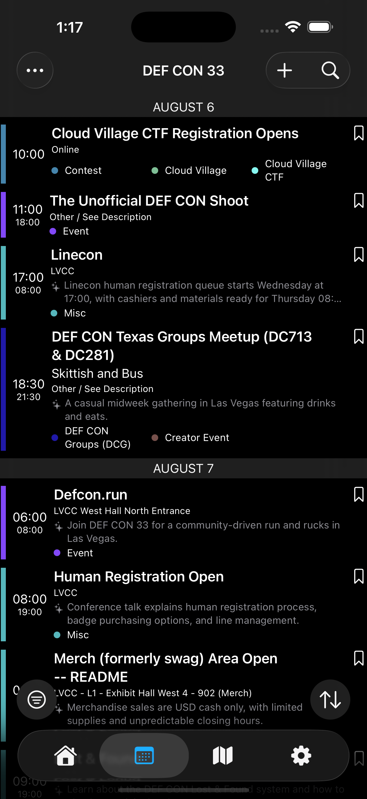

# Quick Start

Five minutes from install to bookmarked schedule.

## 1. Install

HackerTracker is available on the App Store: search **HackerTracker** or follow the link from [defcon.org](https://defcon.org).

Requirements: iOS 17 or later. iPad supported with a custom split-view layout.

## 2. First launch

The app opens to the **Info** tab (the house icon, far left of the tab bar). It picks a default conference automatically — usually the next upcoming or currently-active one.

If the wrong conference is loaded, tap **Settings → Select Conference** to pick a different one. The app saves your choice across launches.

## 3. Browse the schedule

Tap the **calendar** icon in the tab bar to open the Schedule. You'll see every event grouped by day. Scroll or use the floating **Top / Bottom** circles at the bottom-right of the screen to jump.

- Tap any event row to see its full description, speakers, location, and tags.
- Tap the **bookmark** outline on the right of a row to save it. The icon fills in to confirm.
- Tap the **filter** circle in the bottom-left to narrow the schedule by tags, your bookmarks, or other chips.

## 4. Search

Tap the **magnifying glass** in the top-right of any list screen to start typing. Search is debounced — the list refreshes after you pause typing.

## 5. Find a room

Tap the **map** icon in the tab bar. Swipe between maps; pinch to zoom; or use the floating zoom controls on the bottom-left. If the conference publishes a searchable SVG version, a magnifying-glass search field appears on the trailing side of the toolbar.

## 6. Make it yours

Things that only you can see, all stored locally and synced to your other devices via iCloud:

- **Bookmarks** (above) — saved events.
- **Custom events** — your own schedule entries. Tap the **+** in the Schedule toolbar. See [Custom events](custom-events.md).
- **Private notes** — Markdown-formatted notes attached to any event, talk, or custom event. Open any detail screen, scroll to the bottom, tap **My Notes → Show → Add a note**. See [Notes](notes.md).

## Next reading

- [Tabs and navigation](navigation.md)
- [Schedule view](schedule.md)
- [Bookmarking events](bookmarks.md)
- [Custom events](custom-events.md)
- [Private notes](notes.md)
