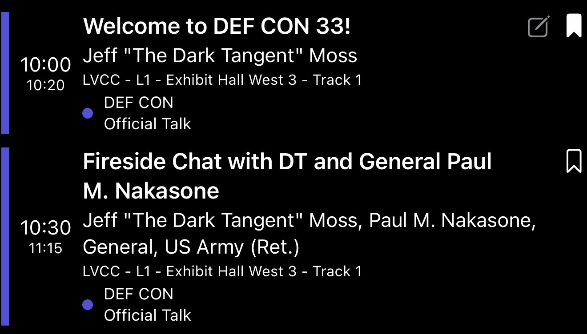
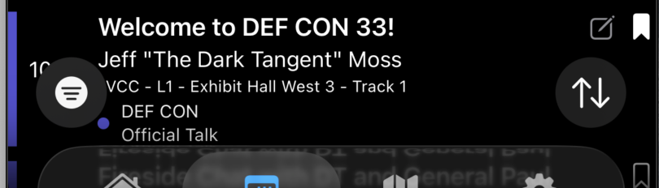

# Schedule view

The day-by-day agenda. Available from the calendar icon in the tab bar.

## Layout

Events are grouped by day. Inside each day, rows are sorted chronologically.

Each row shows:
- **Time block** (start and end) on the left.
- A **colored stripe** indicating the event's primary tag color.
- **Title**, **speakers**, **location**, and **tag chips** in the middle.
- Status icons on the right:
  - **Pencil** (gray) — this event has a [saved private note](notes.md).
  - **Bookmark** — outline or filled. Filled = bookmarked. **Red** = bookmarked AND conflicting with another bookmark.
  - **Sparkle ✨ + summary line** — appears under the speaker line when [AI summaries](ai-summaries.md) are enabled and the model has generated one.

## Row actions

| Action | Effect |
|---|---|
| Tap row | Open the talk's detail view |
| Tap bookmark | Toggle bookmarked state |
| Swipe row left | Same as tapping bookmark |
| Long-press a row with an AI summary | Peek at the original (uncompressed) description |
| Tap pencil-or-bookmark icon | Same as the row tap for navigation; bookmark icon also toggles |

## Toolbar controls

The Schedule's toolbar (top of the screen) carries:

**Trailing side**
- **+** — Add a new [custom event](custom-events.md).
- **Magnifying glass** — Open the search field.

**Leading side**
- **Menu** (three dots) — Toggle local time, 24-hour time, hide past events, share schedule QR.
- **Conflict indicator** — Red warning triangle when bookmarked events overlap each other.

## Floating controls

**Bottom-left circle** — Filter sheet. See [Search and filter](search-and-filter.md).

**Bottom-right circle** — Top / Bottom / Current / Next jump menu.

## Custom events in the schedule

Custom events you've created appear inline with the official ones, sorted by time. They carry:
- Your chosen accent color in the row's left stripe.
- A small **"Custom Event"** chip in the tag area.
- The standard pencil / bookmark icons on the right.

Tap a custom event to open its detail view, which adds **Edit**, **Share via QR**, and **Delete** affordances. See [Custom events](custom-events.md).

## Hiding past events

**Settings → Show Past Events** off — past events disappear from the schedule entirely.

## Conference timezone vs your local time

By default, the schedule renders in the **conference's local timezone** (the venue's wall clock). Toggle **Settings → Show Local Timezone** to show times in your device's current timezone instead. Useful if you're remote or traveling.

The current active timezone shows under the toggle in Settings.

## See also

- [Bookmarking events](bookmarks.md)
- [Combined Bookmark Schedule](combined-schedule.md)
- [Custom events](custom-events.md)
- [Private notes](notes.md)
- [Search and filter](search-and-filter.md)
