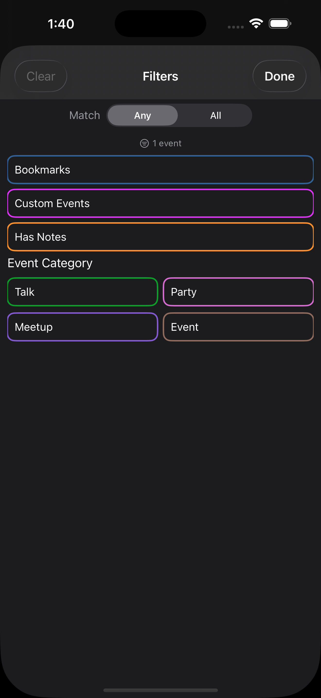
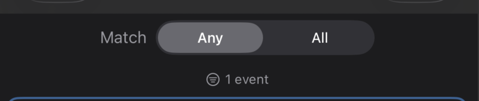

# Search and filter

Two complementary tools for narrowing list views.

## Search

The **magnifying glass** icon in the top-right of every list (Schedule, All Content, Speakers, Orgs, Merch) opens an inline search bar.

- Searching is **case-insensitive** and matches against title + description fields (and speaker names on Schedule + Content rows).
- The list updates after a short **debounce** so you can type quickly without re-filtering on every keystroke.
- Tap the **X** to clear the field; the **magnifying glass** to close the search bar entirely.

## Filter sheet

The **filter circle** in the bottom-left of list views opens the filter sheet.



Layout:
```
[ Match   ( Any | All ) ]
( 12 events )                ← live tally
─────────────────────────
[ Bookmarks ]                ← pseudo-tag chips (top)
[ Custom Events ]
[ Has Notes ]

Event Category
[ Talk ]  [ Demo Lab ]  [ Workshop ] ...

Skill Level
[ Beginner ]  [ Intermediate ] ...

Organizer
[ AppSec Village ]  [ Cloud Village ] ...
```

### Pseudo-tag chips

Three special chips at the top — they don't correspond to real tags in the data, but to filter behaviors:

| Chip | Behavior |
|---|---|
| **Bookmarks** | Only show events you've bookmarked |
| **Custom Events** | Only show user-created events |
| **Has Notes** | Only show events that have a saved private note (kind `event`, `content`, or `customEvent`) |

### Real tag chips

Tag chips are organized by **tag type** (Event Category, Skill Level, Organizer, etc.). Each chip uses the conference's color for that tag.

Tap to add to the current selection; tap again to remove.

### Match Any / Match All

At the very top of the sheet, a segmented control switches between two composition modes:

- **Any** (default) — A row survives when **any** selected chip matches it. Selecting "Bookmarks + Custom Events" returns the **union** (all bookmarks plus all custom events).
- **All** — A row must satisfy **every** selected chip. Selecting "Bookmarks + Custom Events" returns the **intersection** (only custom events that are also bookmarked).

Mode persists across launches.



### Live tally

Just below the picker, a small label shows the **count of rows that will be visible** with your current selection — `12 events`, `47 talks`, `3 products`. Updates as you toggle chips.

### Clear and Done

- **Clear** (top-left) wipes all selected chips. Disabled when nothing's selected.
- **Done** (top-right, bold) closes the sheet.

## Filter parity across list types

The same filter UI appears on the Schedule, All Content, and Merch screens. The pseudo-tag chips that apply vary by context:

| List | Bookmarks | Custom Events | Has Notes | Sizes |
|---|---|---|---|---|
| Schedule | ✓ | ✓ | ✓ | — |
| All Content | ✓ | (no custom events on this list) | ✓ | — |
| Merch | — | — | — | ✓ (in-stock sizes) |

The Merch filter ("Filter by Size") has the same chrome and the same Match Any / All toggle. Any = at least one selected size is in stock for the product. All = every selected size is in stock (useful when buying bundles).

## See also

- [Schedule view](schedule.md)
- [Bookmarking events](bookmarks.md)
- [Private notes](notes.md)
